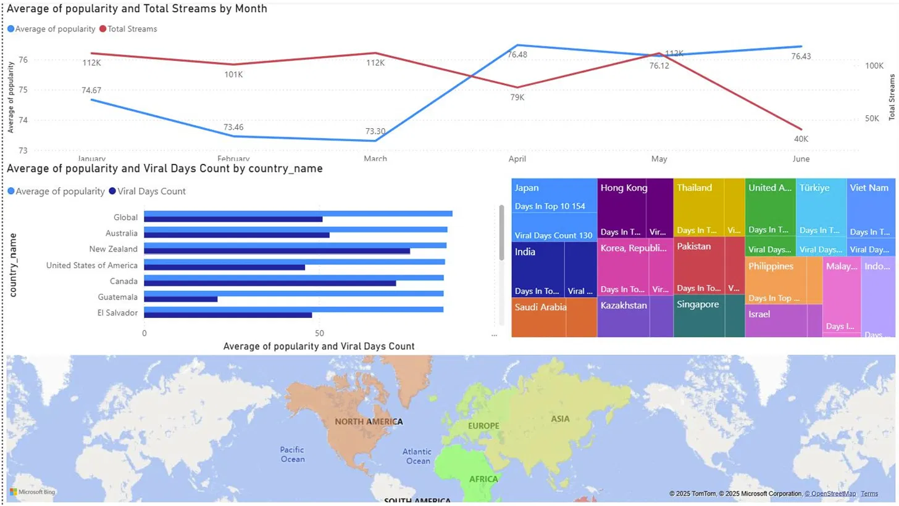
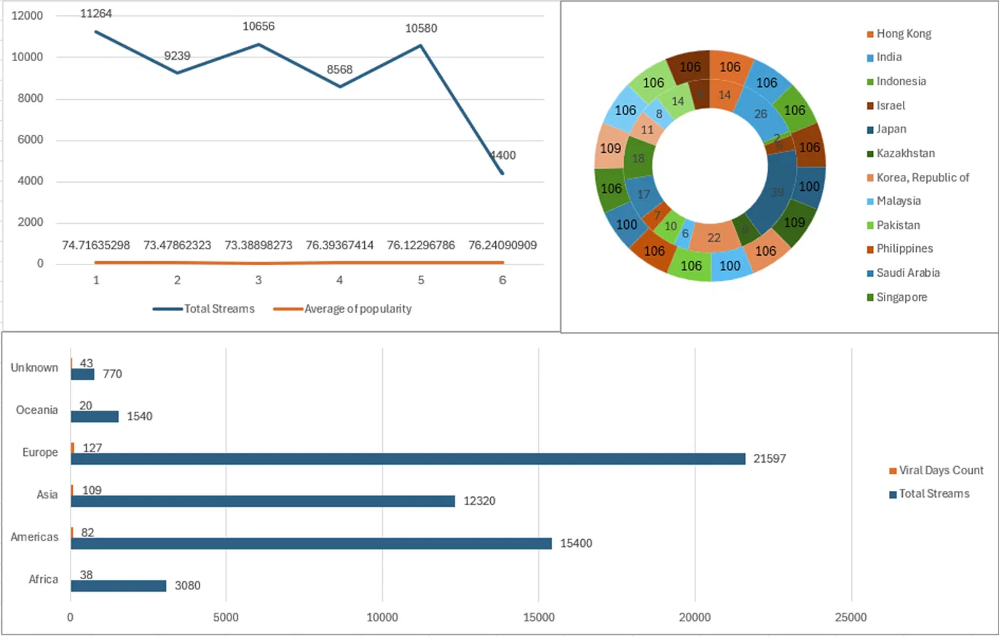

# 🎧 Spotify Music Trend Analysis — Data Warehouse & OLAP

An end-to-end Business Intelligence project that transforms raw, daily Spotify chart
data into a dimensional data warehouse, an OLAP cube for multi-dimensional analysis,
interactive Power BI dashboards, and a clustering study that segments songs by
audio-feature "sound profile."

> Course project — **IS217: Kho dữ liệu và OLAP**, University of Information
> Technology (VNU-HCM), Dec 2025
> Instructor: ThS. Nguyễn Thị Kim Phụng
> Team: Phan Thị Xuân Tiên · Nguyễn Văn Thanh Sơn

📄 [Full report (PDF)](./OLAPReport.pdf)

---

## 📌 Overview

Streaming platforms like Spotify generate massive amounts of daily chart data, but
turning that raw data into decision-ready insight requires more than a spreadsheet.
This project builds a complete analytics pipeline — from raw CSV to business
insight — to answer questions such as:

- Which genres and artists are trending, and where?
- Which countries show the strongest and most durable listening trends?
- Can songs be automatically grouped into meaningful "sound" segments without
  relying on manually-tagged genres?

## 🗂️ Dataset

| Dataset | Source | Size |
|---|---|---|
| Top Spotify Songs in 73 Countries (Daily Updated) | [Kaggle – asaniczka](https://www.kaggle.com/datasets/asaniczka/top-spotify-songs-in-73-countries-daily-updated) | 2,110,316 rows × 25 attributes (Oct 2023 – Jun 2025) |
| ISO-3166 Countries with Regional Codes | [GitHub – lukes](https://github.com/lukes/ISO-3166-Countries-with-Regional-Codes) | 249 rows × 11 attributes |

The Spotify dataset tracks the daily Top 50 chart in each of 73 countries, including
audio features (danceability, energy, valence, tempo, etc.), artist/album metadata,
and rank movement. Data was filtered to the 2025 window and cleaned with
**pandas/numpy** (type normalization, missing-value handling, country code
standardization, explicit-content flag cleanup) before loading, resulting in
**17,815 unique tracks** used for downstream analysis.

## 🏗️ Architecture

```
Kaggle CSV (raw)
      │  pandas / numpy cleaning
      ▼
 SSIS ETL Packages ──► SQL Server Data Warehouse (Star Schema)
      │                        │
      │                        ▼
      │                 SSAS OLAP Cube ──► MDX analytical queries
      │
      └──► Python EDA + Clustering (scikit-learn) ──► Music-trend segments
                        │
                        ▼
              Power BI Dashboards (+ Excel cross-checks)
```

## 🧱 Data Warehouse Design (Star Schema)

A central fact table connected to four dimension tables:

- **Fact_Daily** — one row per (song, country, day): `daily_rank`,
  `daily_movement`, `weekly_movement`, `popularity`
- **Dim_Date** — calendar attributes (`year`, `month`, `quarter`, `day_of_week`,
  `is_weekend`)
- **Dim_Country** — ISO country code, region, sub-region
- **Dim_Genre** — proxy genre label (e.g., `Pop/Mixed`, `Dance/Party`)
- **Dim_Track** — track/artist/album metadata and audio features
  (danceability, energy, loudness, tempo, valence, acousticness, etc.)

ETL packages were built in **SSIS** to clean, deduplicate, and incrementally
load the dimension and fact tables into **SQL Server**.

## 🧊 OLAP Analysis (SSAS)

An OLAP cube was built in **SSAS** on top of the warehouse, enabling fast
multi-dimensional slicing across time, geography, genre, and track. The cube
powered **16+ analytical queries**, including:

- Global listening trends by month/quarter
- Regional market potential and cross-country comparisons (e.g., US vs. Australia
  vs. Japan; Vietnam vs. Thailand)
- Artist-specific deep dives (e.g., Taylor Swift catalog performance)
- Longest-charting tracks and albums, and "viral but short-lived" hits

## 📊 Power BI Dashboards

Five interactive dashboards were built (cross-validated against Excel pivot
analysis):

1. **Global Market Overview** — monthly popularity/stream trends, country
   treemap of chart durability & virality, geographic hotspot map
2. **Artist & Track Performance** — Total Streams vs. Max Popularity vs. Best
   Rank, identifying "durable hits" vs. seasonal spikes (e.g., holiday songs)
3. **Genre by Country** — genre popularity distribution across markets
4. **Album Performance** — albums with sustained high average popularity
5. **Cross-Country Comparison** — side-by-side market comparisons

**Sample insight:** Japan stood out with 154 days in the Top 10 *and* 130 "viral"
days — a market with both loyal, sustained listening and strong viral spread.

### Dashboard 1 — Global Market Overview



- **Popularity vs. Streams by month:** Average popularity dipped from 74.67
  (Jan) to a Q1 low of 73.30 (Mar), then climbed to a Q2 high of 76.48 (Apr) and
  held above 76 through May–June. Total Streams, meanwhile, held around
  100K–112K through May before dropping sharply to ~40K in June — a gap most
  likely caused by partial-month data at collection time rather than an actual
  drop in listening.
- **Durability & virality by country (treemap):** Japan leads decisively with
  **154 days in the Top 10** and **130 viral days**, well ahead of Hong Kong,
  Thailand, and other Asian markets in the sample — evidence of an unusually
  loyal *and* highly viral listener base.
- **Popularity vs. viral days by country (bar chart):** Among the sampled
  markets, New Zealand and the United States post strong viral-day counts
  alongside high average popularity, while Guatemala trails on both metrics.
- **Geographic hotspot map:** Confirms the Americas, Europe, and East Asia as
  the densest markets, supporting drill-down into the Cross-Country
  Comparison dashboard.

### Dashboard 5 — Monthly Trends & Country Comparison



- **Streams vs. popularity trend:** Total Streams trended downward across the
  six periods analyzed (11,264 → 9,239 → 10,656 → 8,568 → 10,580 → 4,400),
  while Average Popularity stayed remarkably stable in the 73–76 range —
  reinforcing that raw stream volume and song popularity don't move together
  1:1 in this dataset.
- **Country breakdown (donut):** Most sampled countries (India, Indonesia,
  Japan, Korea, Malaysia, Pakistan, Saudi Arabia, Singapore, etc.) had
  comparable data coverage (~106 each), but their inner-ring viral counts
  varied widely — **Japan led at 39**, versus single digits for Israel (6) and
  Hong Kong (14) — showing virality is driven by market behavior, not just
  data volume.
- **Continent breakdown (bar chart):** Europe led on both **Total Streams
  (21,597)** and **Viral Days Count (127)**, followed by the Americas (15,400 /
  82) and Asia (12,320 / 109). Notably, Asia posted *more* viral days than the
  Americas despite lower total stream volume — a sign of higher viral
  intensity per stream in Asian markets.


## 🔍 Data Mining: Song Clustering

Using **scikit-learn**, the team ran exploratory data analysis (15 statistical
charts) and benchmarked three unsupervised clustering algorithms on audio
features:

| Algorithm | Silhouette Score | Notes |
|---|---|---|
| K-Means (K=4) | 0.1956 | Balanced cluster sizes, most interpretable |
| Hierarchical (Ward) | 0.2088 | Highest score, but highly imbalanced clusters (max 73%) |
| DBSCAN | 0.0889 | Collapsed ~90% of data into one cluster |

**K-Means (K=4)** was selected as the final model for its balance of cluster
size, separability, and interpretability. The four resulting segments:

- **Cluster 0 — Rap/Upbeat** (2,815 tracks, 15.8%)
- **Cluster 1 — Mainstream/High-Energy Dance** (10,060 tracks, 56.5%)
- **Cluster 2 — Instrumental/Niche** (424 tracks, 2.4%)
- **Cluster 3 — Acoustic/Chill Ballad** (4,516 tracks, 25.3%)

These segments, along with simple feature-based rules (e.g., instrumentalness
and speechiness thresholds), were proposed as the foundation for a
context-aware recommendation system (e.g., "Focus/Work" playlists from Clusters
2–3, "Workout/Party" playlists from Clusters 0–1).

## 🛠️ Tech Stack

`SQL Server` · `SSIS` · `SSAS` · `Power BI` · `Excel` · `Python` (`pandas`,
`numpy`, `scikit-learn`, `matplotlib`/`seaborn`)

## ⚠️ Limitations & Future Work

- June 2025 data was a partial month at time of collection, skewing month-over-month
  trend comparisons.
- Clustering relies solely on audio features; no user-behavior data (skips, replays,
  listening history) was available, limiting personalization depth.
- Proposed next steps: ingest user-behavior logs, combine content-based clustering
  with collaborative filtering for a hybrid recommender, and migrate the warehouse
  to a cloud platform (Azure Synapse / BigQuery) for scale.

## 📎 Repository Contents

- `report/` — full project report (PDF)
- `images/` — Power BI dashboard screenshots
- `queries/` — sample MDX/OLAP and SQL queries
- `notebooks/` — EDA and clustering notebook (Python)

---

*This was a group project for the IS217 course. My primary contributions covered
the SQL Server/SSIS/SSAS data warehouse and OLAP layer, the Power BI dashboards,
and the clustering analysis.*